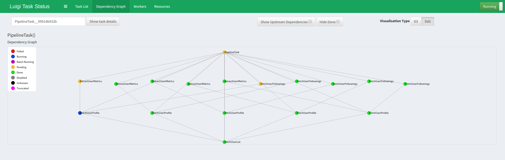

## Readme
This project sets up a data engineering pipeline for harvesting top author data from Medium. It demonstrates some features of [Luigi](https://github.com/spotify/luigi):

- parallel processing
- running inside Docker
- unit testing Luigi tasks

There is a full write up [here]().

## Quickstart
Start the services with:

    docker-compose up -d

This will start the Luigi workflow service and the `example` service.

